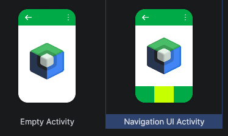
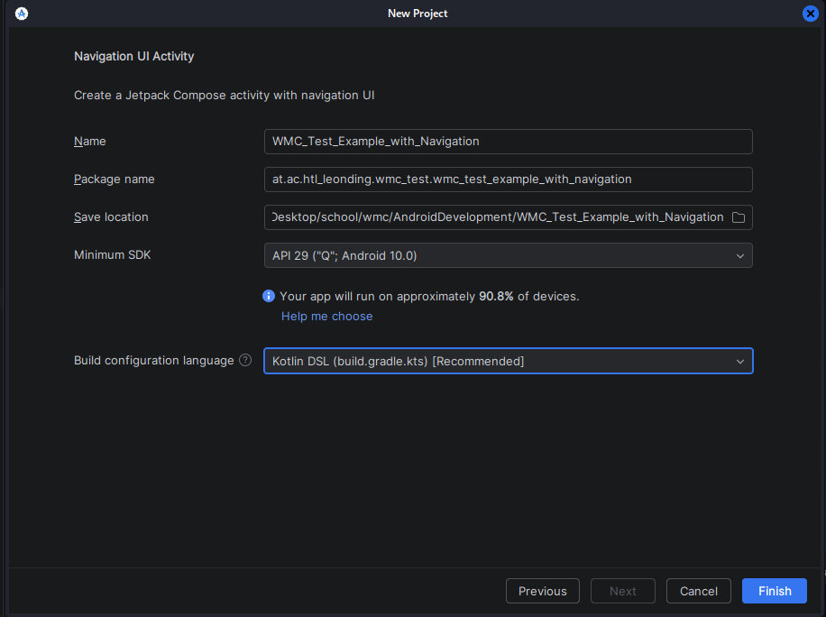
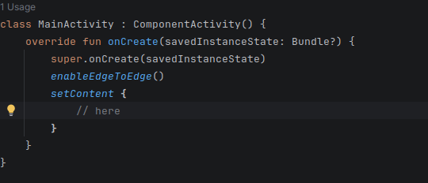

# Android Development

## Create a new Project

First, open Android Studio and make a new Project. Depending on the Test-Assignment choose between an `Empty Activity` or `Navigation UI Activity`



Select `Android 10.0` and choose a name and save folder.



## Add and Modify Layouts using Modifiers
Layouts in Jetpack Compose are controlled with `Modifier`.

```kotlin
Column(
    modifier = Modifier
        .fillMaxSize()
        .padding(16.dp)
) {
    Text("Hello World")
}
```

### Common modifiers:
- padding()
- fillMaxSize()
- fillMaxWidth()
- height()
- width()
- background()

## Add Components and Modify them using Modifiers
### Text
```kotlin
Text(
    text = "Title",
    fontSize = 24.sp,
    fontWeight = FontWeight.Bold
)
```

### Button
```kotlin
Button(
    onClick = { 
        // here call functions or whatever
    },
    modifier = Modifier.fillMaxWidth()
) {
    Text("Click me")
}
```

### TextField
```kotlin
// you can think about this like a signal in vite
var name by remember { mutableStateOf("") }

TextField(
    value = name,
    // "it" is a special variable. its like the "this" object
    onValueChange = { name = it },
    label = { Text("Name") }
)
```


## Add Dependencies (Navigation 3 + Serialization)

### libs.versions.toml
Add:
```toml
[versions]
navigation3Runtime = "1.0.1"
kotlinxSerializationCore = "1.6.3"

[plugins]
jetbrains-kotlin-serialization = { id = "org.jetbrains.kotlin.plugin.serialization", version.ref = "kotlin" }

[libraries]
androidx-navigation3-runtime = { module = "androidx.navigation3:navigation3-runtime", version.ref = "navigation3Runtime" }
androidx-navigation3-ui = { module = "androidx.navigation3:navigation3-ui", version.ref = "navigation3Runtime" }
kotlinx-serialization-core = { module = "org.jetbrains.kotlinx:kotlinx-serialization-core", version.ref = "kotlinxSerializationCore" }
```

### build.gradle.kts (Module)
**Add plugin:**
```kotlin
plugins {
    alias(libs.plugins.jetbrains.kotlin.serialization)
}
```

**Add dependencies:**
```kotlin
dependencies {
    implementation(libs.androidx.navigation3.runtime)
    implementation(libs.androidx.navigation3.ui)
    implementation(libs.kotlinx.serialization.core)
}
```

**Then click Sync Now.**

## Create Navigation Keys (Destinations)
Create a new file called: `NavKeys.kt`

```kotlin
import androidx.navigation3.runtime.NavKey
import kotlinx.serialization.Serializable

@Serializable
data class Home(val title: String) : NavKey

@Serializable
data class Profile(val title: String) : NavKey
```

`NavKey` = destination
`@Serializable` = needed for state restore
`data class` = allows type-safe parameters

## Create Screens (UI Pages)
Create a new file called: `Screens.kt`

### HomeScreen
```kotlin
@Composable
fun HomeScreen(
    title: String,
    onProfileClick: () -> Unit
) {
    Column(
        modifier = Modifier.fillMaxSize(),
        verticalArrangement = Arrangement.Center,
        horizontalAlignment = Alignment.CenterHorizontally
    ) {
        Text(
            title,
            style = MaterialTheme.typography.headlineLarge
        )

        Spacer(modifier = Modifier.height(16.dp))

        Button(onClick = onProfileClick) {
            Text("Go to Profile")
        }
    }
}
```

### ProfileScreen
```kotlin
@Composable
fun ProfileScreen(title: String) {
    Column(
        modifier = Modifier.fillMaxSize(),
        verticalArrangement = Arrangement.Center,
        horizontalAlignment = Alignment.CenterHorizontally
    ) {
        Text(
            title,
            style = MaterialTheme.typography.headlineLarge
        )

        Spacer(modifier = Modifier.height(8.dp))

        Text("Welcome to the profile!")
    }
}
```

## Central Navigation with NavDisplay
In `MainActivity.kt` inside `setContent {}`:



```kotlin
val backStack = rememberNavBackStack(Home("Home"))

Scaffold(modifier = Modifier.fillMaxSize()) { innerPadding ->
    NavDisplay(
        backStack = backStack,
        onBack = { backStack.removeLastOrNull() },
        modifier = Modifier.padding(innerPadding),
        entryProvider = entryProvider {
            entry<Home> { key ->
                HomeScreen(
                    title = key.title,
                    onProfileClick = {
                        backStack.add(Profile("Profile"))
                    }
                )
            }
            entry<Profile> { key ->
                ProfileScreen(title = key.title)
            }
        }
    )
}
```

**Navigation works by changing the backstack:**
+ `backStack.add(Profile(...))` -> forward
+ `backStack.removeLastOrNull()` -> back

this works like the callstack in the cpu


## Parameter Passing (Type-Safe)
**Example:**
```kotlin
backStack.add(Profile("My Profile Title"))
```

Inside the entry:
```kotlin
entry<Profile> { key ->
    ProfileScreen(title = key.title)
}
```